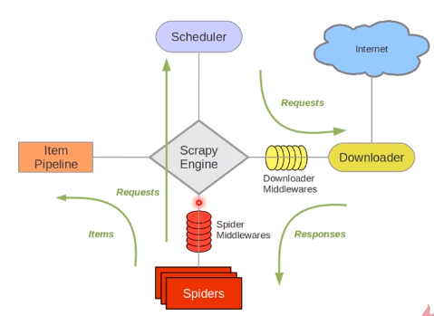

## Scrapy
* 基于Twisted的异步处理框架,纯python实现的爬虫框架

## 调试时
* 注释掉`settings.py` 最后的5行 
  答：这几行注释的作用是，Scrapy会缓存你有的Requests!当你再次请求时，如果存在缓存文档则返回缓存文档，而不是去网站请求，这样既加快了本地调试速度，也减轻了 网站的压力。一举多得【但最好在第一次成功call通的情况下，再enable 这个选项】

## 整个scrapy框架

整个数据处理流动过程：

1. Engine 问 Spiders ，“你需要处理哪个url？”
2. Spiders把将要处理的目标url告诉Engine
3. Engine 向 Scheduler 打招呼，说：“我这里有一个url请求，你帮我把这个task 进行排队”
4. Engine 不断主动问 Scheduler ：“你有没有已经封装好request的task可以出队的？ 有就拿给我，我叫人把它办了。”
5. Scheduler 发现排队排到了，就将这个task出队，给到 Engine
6. Engine 将 Scheduler扔过来的request ，转扔给Downloader去进行下载
7. Downloader如果没有处理好，会发出反馈给到Engine，Engine 又需要把这个失败的request 扔给 Scheduler 重新入队。
8. Downloader处理好了，response也会给到Engine，Engine将数据给到 Spider
9. Spider 进行数据解剖，并判断有没有新的请求url， 一顿操作，拿出两部分数据：
  * 干货：拿给Pipeline，进行数据的清洗和存储
  * 新的url请求： 扔给Engine，重复上面步骤

## 编写流程
1. 在`items.py` 中定义类，你要爬取什么数据，就定义相应的字段。
2. 在`spiders` 文件夹中定义自己的爬虫
3. 在`pipelines.py` 中存储自己的数据
4. (可选) 改 `settings.py`

## 跑scrapy 之前，需要保证你的venv或者全局Python环境存在两个环境库：
1. pypiwin32 (`pip install pypiwin32` ，或者去[这里](https://sourceforge.net/projects/pywin32/files/pywin32/Build%20221/pywin32-221.win-amd64-py3.6.exe/download) for 全局安装)
2. Twisted (去[这里](https://www.lfd.uci.edu/~gohlke/pythonlibs/#twisted)下载，然后pip 安装它)

## 参考文章
* [小白入门scrapy](https://cuiqingcai.com/3472.html)